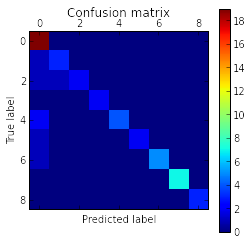

### Esempio di Cross Validation 

Un esempio di utilizzo della funzionalità di scikit "GridSearch", che permette
in maniera automatica di fare model selection tramite cross validation su un
dato insieme di parametri.

Per fare un test ho provato a "indovinare" il target da assegnare ad ogni
posizione con una soglia sulla deviazione standard di una delle variabili, da
ricordare che questo introduce ulteriori imprecisioni e errori nei dati ( vedi
l'ultimo plot in [features notebook](featured_data.ipynb)).

    import feature_man as fm
    import plotting as plt
    import preprocessing as prproc
    
    import matplotlib.pyplot as pl
    import matplotlib.cm as cm
    
    from sklearn.decomposition import PCA
    from sklearn.cluster import KMeans
    import numpy as np
    
    import mars as ms
    
    window_length = 50
    overlap = window_length/2
    featdim = 10
    
    data,sgmdata = ms.load_dataset(window_length,overlap)
    
    featdata,header = ms.build_dataset_features(sgmdata)
    targets = fm.assign_target(featdata)

Il modello su cui ho fatto model selection è costituito da una "pipeline"
formata da tre stadi:

* normalizzazione

* PCA, di cui vario il numero di feature da estrarre tra [5,10,20,50,80]

* SVM di cui vario

    - il tipo di kernel tra [linear,rbf]

    - gamma tra [ 1e-1,1e-2,1e-3,1e-4,1e-5]

    - C tra [0.001,0.01,0.1,1, 10, 100]

    
    import classification as cl
    X_r = featdata
    
    pars =[
    {'clf__kernel': ['rbf'], 'clf__gamma': [1e-3, 1e-5,1e-2,1e-1,1e-4],
     'clf__C': [0.001,0.01,0.1,1, 10, 100], 'pca__n_components': [5,10,20,50,80]},
    {'clf__kernel': ['linear'], 'clf__C': [0.001,0.01,0.1,0.5,1, 10, 100], 'pca__n_components': [5,10,20,50,80]}]
    
    #evaluation set
    cl.cross_model_selection(X_r,targets,pars,save=False)

    # Tuning hyper-parameters for accuracy
    ()
    Best parameters set found on development set:
    ()
    Pipeline(steps=[('scaler', StandardScaler(copy=True, with_mean=True, with_std=True)), ('pca', PCA(copy=True, n_components=50, whiten=False)), ('clf', SVC(C=100, cache_size=200, class_weight=None, coef0=0.0, degree=3, gamma=0.01,
      kernel='rbf', max_iter=-1, probability=False, random_state=None,
      shrinking=True, tol=0.001, verbose=False))])
    ()
    Grid scores on development set:
    ()
    0.278 (+/-0.017) for {'clf__gamma': 0.001, 'pca__n_components': 5, 'clf__C': 0.001, 'clf__kernel': 'rbf'}
    0.278 (+/-0.017) for {'clf__gamma': 0.001, 'pca__n_components': 10, 'clf__C': 0.001, 'clf__kernel': 'rbf'}
    0.278 (+/-0.017) for {'clf__gamma': 0.001, 'pca__n_components': 20, 'clf__C': 0.001, 'clf__kernel': 'rbf'}
    0.278 (+/-0.017) for {'clf__gamma': 0.001, 'pca__n_components': 50, 'clf__C': 0.001, 'clf__kernel': 'rbf'}
    0.278 (+/-0.017) for {'clf__gamma': 0.001, 'pca__n_components': 80, 'clf__C': 0.001, 'clf__kernel': 'rbf'}
    0.278 (+/-0.017) for {'clf__gamma': 1e-05, 'pca__n_components': 5, 'clf__C': 0.001, 'clf__kernel': 'rbf'}
    0.278 (+/-0.017) for {'clf__gamma': 1e-05, 'pca__n_components': 10, 'clf__C': 0.001, 'clf__kernel': 'rbf'}
    0.278 (+/-0.017) for {'clf__gamma': 1e-05, 'pca__n_components': 20, 'clf__C': 0.001, 'clf__kernel': 'rbf'}
    0.278 (+/-0.017) for {'clf__gamma': 1e-05, 'pca__n_components': 50, 'clf__C': 0.001, 'clf__kernel': 'rbf'}
    0.278 (+/-0.017) for {'clf__gamma': 1e-05, 'pca__n_components': 80, 'clf__C': 0.001, 'clf__kernel': 'rbf'}
    0.278 (+/-0.017) for {'clf__gamma': 0.01, 'pca__n_components': 5, 'clf__C': 0.001, 'clf__kernel': 'rbf'}
    0.278 (+/-0.017) for {'clf__gamma': 0.01, 'pca__n_components': 10, 'clf__C': 0.001, 'clf__kernel': 'rbf'}
    0.278 (+/-0.017) for {'clf__gamma': 0.01, 'pca__n_components': 20, 'clf__C': 0.001, 'clf__kernel': 'rbf'}
    0.278 (+/-0.017) for {'clf__gamma': 0.01, 'pca__n_components': 50, 'clf__C': 0.001, 'clf__kernel': 'rbf'}
    0.278 (+/-0.017) for {'clf__gamma': 0.01, 'pca__n_components': 80, 'clf__C': 0.001, 'clf__kernel': 'rbf'}
    0.278 (+/-0.017) for {'clf__gamma': 0.1, 'pca__n_components': 5, 'clf__C': 0.001, 'clf__kernel': 'rbf'}
    0.278 (+/-0.017) for {'clf__gamma': 0.1, 'pca__n_components': 10, 'clf__C': 0.001, 'clf__kernel': 'rbf'}
    0.278 (+/-0.017) for {'clf__gamma': 0.1, 'pca__n_components': 20, 'clf__C': 0.001, 'clf__kernel': 'rbf'}
    0.278 (+/-0.017) for {'clf__gamma': 0.1, 'pca__n_components': 50, 'clf__C': 0.001, 'clf__kernel': 'rbf'}
    0.278 (+/-0.017) for {'clf__gamma': 0.1, 'pca__n_components': 80, 'clf__C': 0.001, 'clf__kernel': 'rbf'}
    0.278 (+/-0.017) for {'clf__gamma': 0.0001, 'pca__n_components': 5, 'clf__C': 0.001, 'clf__kernel': 'rbf'}
    0.278 (+/-0.017) for {'clf__gamma': 0.0001, 'pca__n_components': 10, 'clf__C': 0.001, 'clf__kernel': 'rbf'}
    0.278 (+/-0.017) for {'clf__gamma': 0.0001, 'pca__n_components': 20, 'clf__C': 0.001, 'clf__kernel': 'rbf'}
    0.278 (+/-0.017) for {'clf__gamma': 0.0001, 'pca__n_components': 50, 'clf__C': 0.001, 'clf__kernel': 'rbf'}
    0.278 (+/-0.017) for {'clf__gamma': 0.0001, 'pca__n_components': 80, 'clf__C': 0.001, 'clf__kernel': 'rbf'}
    0.278 (+/-0.017) for {'clf__gamma': 0.001, 'pca__n_components': 5, 'clf__C': 0.01, 'clf__kernel': 'rbf'}
    0.278 (+/-0.017) for {'clf__gamma': 0.001, 'pca__n_components': 10, 'clf__C': 0.01, 'clf__kernel': 'rbf'}
    0.278 (+/-0.017) for {'clf__gamma': 0.001, 'pca__n_components': 20, 'clf__C': 0.01, 'clf__kernel': 'rbf'}
    0.278 (+/-0.017) for {'clf__gamma': 0.001, 'pca__n_components': 50, 'clf__C': 0.01, 'clf__kernel': 'rbf'}
    0.278 (+/-0.017) for {'clf__gamma': 0.001, 'pca__n_components': 80, 'clf__C': 0.01, 'clf__kernel': 'rbf'}
    0.278 (+/-0.017) for {'clf__gamma': 1e-05, 'pca__n_components': 5, 'clf__C': 0.01, 'clf__kernel': 'rbf'}
    0.278 (+/-0.017) for {'clf__gamma': 1e-05, 'pca__n_components': 10, 'clf__C': 0.01, 'clf__kernel': 'rbf'}
    0.278 (+/-0.017) for {'clf__gamma': 1e-05, 'pca__n_components': 20, 'clf__C': 0.01, 'clf__kernel': 'rbf'}
    0.278 (+/-0.017) for {'clf__gamma': 1e-05, 'pca__n_components': 50, 'clf__C': 0.01, 'clf__kernel': 'rbf'}
    0.278 (+/-0.017) for {'clf__gamma': 1e-05, 'pca__n_components': 80, 'clf__C': 0.01, 'clf__kernel': 'rbf'}
    0.278 (+/-0.017) for {'clf__gamma': 0.01, 'pca__n_components': 5, 'clf__C': 0.01, 'clf__kernel': 'rbf'}
    0.278 (+/-0.017) for {'clf__gamma': 0.01, 'pca__n_components': 10, 'clf__C': 0.01, 'clf__kernel': 'rbf'}
    0.278 (+/-0.017) for {'clf__gamma': 0.01, 'pca__n_components': 20, 'clf__C': 0.01, 'clf__kernel': 'rbf'}
    0.278 (+/-0.017) for {'clf__gamma': 0.01, 'pca__n_components': 50, 'clf__C': 0.01, 'clf__kernel': 'rbf'}
    0.278 (+/-0.017) for {'clf__gamma': 0.01, 'pca__n_components': 80, 'clf__C': 0.01, 'clf__kernel': 'rbf'}
    0.278 (+/-0.017) for {'clf__gamma': 0.1, 'pca__n_components': 5, 'clf__C': 0.01, 'clf__kernel': 'rbf'}
    0.278 (+/-0.017) for {'clf__gamma': 0.1, 'pca__n_components': 10, 'clf__C': 0.01, 'clf__kernel': 'rbf'}
    0.278 (+/-0.017) for {'clf__gamma': 0.1, 'pca__n_components': 20, 'clf__C': 0.01, 'clf__kernel': 'rbf'}
    0.278 (+/-0.017) for {'clf__gamma': 0.1, 'pca__n_components': 50, 'clf__C': 0.01, 'clf__kernel': 'rbf'}
    0.278 (+/-0.017) for {'clf__gamma': 0.1, 'pca__n_components': 80, 'clf__C': 0.01, 'clf__kernel': 'rbf'}
    0.278 (+/-0.017) for {'clf__gamma': 0.0001, 'pca__n_components': 5, 'clf__C': 0.01, 'clf__kernel': 'rbf'}
    0.278 (+/-0.017) for {'clf__gamma': 0.0001, 'pca__n_components': 10, 'clf__C': 0.01, 'clf__kernel': 'rbf'}
    0.278 (+/-0.017) for {'clf__gamma': 0.0001, 'pca__n_components': 20, 'clf__C': 0.01, 'clf__kernel': 'rbf'}
    0.278 (+/-0.017) for {'clf__gamma': 0.0001, 'pca__n_components': 50, 'clf__C': 0.01, 'clf__kernel': 'rbf'}
    0.278 (+/-0.017) for {'clf__gamma': 0.0001, 'pca__n_components': 80, 'clf__C': 0.01, 'clf__kernel': 'rbf'}
    0.278 (+/-0.017) for {'clf__gamma': 0.001, 'pca__n_components': 5, 'clf__C': 0.1, 'clf__kernel': 'rbf'}
    0.278 (+/-0.017) for {'clf__gamma': 0.001, 'pca__n_components': 10, 'clf__C': 0.1, 'clf__kernel': 'rbf'}
    0.278 (+/-0.017) for {'clf__gamma': 0.001, 'pca__n_components': 20, 'clf__C': 0.1, 'clf__kernel': 'rbf'}
    0.278 (+/-0.017) for {'clf__gamma': 0.001, 'pca__n_components': 50, 'clf__C': 0.1, 'clf__kernel': 'rbf'}
    0.278 (+/-0.017) for {'clf__gamma': 0.001, 'pca__n_components': 80, 'clf__C': 0.1, 'clf__kernel': 'rbf'}
    0.278 (+/-0.017) for {'clf__gamma': 1e-05, 'pca__n_components': 5, 'clf__C': 0.1, 'clf__kernel': 'rbf'}
    0.278 (+/-0.017) for {'clf__gamma': 1e-05, 'pca__n_components': 10, 'clf__C': 0.1, 'clf__kernel': 'rbf'}
    0.278 (+/-0.017) for {'clf__gamma': 1e-05, 'pca__n_components': 20, 'clf__C': 0.1, 'clf__kernel': 'rbf'}
    0.278 (+/-0.017) for {'clf__gamma': 1e-05, 'pca__n_components': 50, 'clf__C': 0.1, 'clf__kernel': 'rbf'}
    0.278 (+/-0.017) for {'clf__gamma': 1e-05, 'pca__n_components': 80, 'clf__C': 0.1, 'clf__kernel': 'rbf'}
    0.397 (+/-0.019) for {'clf__gamma': 0.01, 'pca__n_components': 5, 'clf__C': 0.1, 'clf__kernel': 'rbf'}
    0.389 (+/-0.022) for {'clf__gamma': 0.01, 'pca__n_components': 10, 'clf__C': 0.1, 'clf__kernel': 'rbf'}
    0.389 (+/-0.022) for {'clf__gamma': 0.01, 'pca__n_components': 20, 'clf__C': 0.1, 'clf__kernel': 'rbf'}
    0.389 (+/-0.022) for {'clf__gamma': 0.01, 'pca__n_components': 50, 'clf__C': 0.1, 'clf__kernel': 'rbf'}
    0.389 (+/-0.022) for {'clf__gamma': 0.01, 'pca__n_components': 80, 'clf__C': 0.1, 'clf__kernel': 'rbf'}
    0.278 (+/-0.017) for {'clf__gamma': 0.1, 'pca__n_components': 5, 'clf__C': 0.1, 'clf__kernel': 'rbf'}
    0.278 (+/-0.017) for {'clf__gamma': 0.1, 'pca__n_components': 10, 'clf__C': 0.1, 'clf__kernel': 'rbf'}
    0.278 (+/-0.017) for {'clf__gamma': 0.1, 'pca__n_components': 20, 'clf__C': 0.1, 'clf__kernel': 'rbf'}
    0.278 (+/-0.017) for {'clf__gamma': 0.1, 'pca__n_components': 50, 'clf__C': 0.1, 'clf__kernel': 'rbf'}
    0.278 (+/-0.017) for {'clf__gamma': 0.1, 'pca__n_components': 80, 'clf__C': 0.1, 'clf__kernel': 'rbf'}
    0.278 (+/-0.017) for {'clf__gamma': 0.0001, 'pca__n_components': 5, 'clf__C': 0.1, 'clf__kernel': 'rbf'}
    0.278 (+/-0.017) for {'clf__gamma': 0.0001, 'pca__n_components': 10, 'clf__C': 0.1, 'clf__kernel': 'rbf'}
    0.278 (+/-0.017) for {'clf__gamma': 0.0001, 'pca__n_components': 20, 'clf__C': 0.1, 'clf__kernel': 'rbf'}
    0.278 (+/-0.017) for {'clf__gamma': 0.0001, 'pca__n_components': 50, 'clf__C': 0.1, 'clf__kernel': 'rbf'}
    0.278 (+/-0.017) for {'clf__gamma': 0.0001, 'pca__n_components': 80, 'clf__C': 0.1, 'clf__kernel': 'rbf'}
    0.468 (+/-0.037) for {'clf__gamma': 0.001, 'pca__n_components': 5, 'clf__C': 1, 'clf__kernel': 'rbf'}
    0.556 (+/-0.043) for {'clf__gamma': 0.001, 'pca__n_components': 10, 'clf__C': 1, 'clf__kernel': 'rbf'}
    0.571 (+/-0.040) for {'clf__gamma': 0.001, 'pca__n_components': 20, 'clf__C': 1, 'clf__kernel': 'rbf'}
    0.571 (+/-0.040) for {'clf__gamma': 0.001, 'pca__n_components': 50, 'clf__C': 1, 'clf__kernel': 'rbf'}
    0.571 (+/-0.040) for {'clf__gamma': 0.001, 'pca__n_components': 80, 'clf__C': 1, 'clf__kernel': 'rbf'}
    0.278 (+/-0.017) for {'clf__gamma': 1e-05, 'pca__n_components': 5, 'clf__C': 1, 'clf__kernel': 'rbf'}
    0.278 (+/-0.017) for {'clf__gamma': 1e-05, 'pca__n_components': 10, 'clf__C': 1, 'clf__kernel': 'rbf'}
    0.278 (+/-0.017) for {'clf__gamma': 1e-05, 'pca__n_components': 20, 'clf__C': 1, 'clf__kernel': 'rbf'}
    0.278 (+/-0.017) for {'clf__gamma': 1e-05, 'pca__n_components': 50, 'clf__C': 1, 'clf__kernel': 'rbf'}
    0.278 (+/-0.017) for {'clf__gamma': 1e-05, 'pca__n_components': 80, 'clf__C': 1, 'clf__kernel': 'rbf'}
    0.794 (+/-0.033) for {'clf__gamma': 0.01, 'pca__n_components': 5, 'clf__C': 1, 'clf__kernel': 'rbf'}
    0.770 (+/-0.037) for {'clf__gamma': 0.01, 'pca__n_components': 10, 'clf__C': 1, 'clf__kernel': 'rbf'}
    0.770 (+/-0.037) for {'clf__gamma': 0.01, 'pca__n_components': 20, 'clf__C': 1, 'clf__kernel': 'rbf'}
    0.762 (+/-0.044) for {'clf__gamma': 0.01, 'pca__n_components': 50, 'clf__C': 1, 'clf__kernel': 'rbf'}
    0.762 (+/-0.044) for {'clf__gamma': 0.01, 'pca__n_components': 80, 'clf__C': 1, 'clf__kernel': 'rbf'}
    0.762 (+/-0.062) for {'clf__gamma': 0.1, 'pca__n_components': 5, 'clf__C': 1, 'clf__kernel': 'rbf'}
    0.738 (+/-0.057) for {'clf__gamma': 0.1, 'pca__n_components': 10, 'clf__C': 1, 'clf__kernel': 'rbf'}
    0.754 (+/-0.057) for {'clf__gamma': 0.1, 'pca__n_components': 20, 'clf__C': 1, 'clf__kernel': 'rbf'}
    0.746 (+/-0.059) for {'clf__gamma': 0.1, 'pca__n_components': 50, 'clf__C': 1, 'clf__kernel': 'rbf'}
    0.746 (+/-0.059) for {'clf__gamma': 0.1, 'pca__n_components': 80, 'clf__C': 1, 'clf__kernel': 'rbf'}
    0.278 (+/-0.017) for {'clf__gamma': 0.0001, 'pca__n_components': 5, 'clf__C': 1, 'clf__kernel': 'rbf'}
    0.278 (+/-0.017) for {'clf__gamma': 0.0001, 'pca__n_components': 10, 'clf__C': 1, 'clf__kernel': 'rbf'}
    0.278 (+/-0.017) for {'clf__gamma': 0.0001, 'pca__n_components': 20, 'clf__C': 1, 'clf__kernel': 'rbf'}
    0.278 (+/-0.017) for {'clf__gamma': 0.0001, 'pca__n_components': 50, 'clf__C': 1, 'clf__kernel': 'rbf'}
    0.278 (+/-0.017) for {'clf__gamma': 0.0001, 'pca__n_components': 80, 'clf__C': 1, 'clf__kernel': 'rbf'}
    0.778 (+/-0.051) for {'clf__gamma': 0.001, 'pca__n_components': 5, 'clf__C': 10, 'clf__kernel': 'rbf'}
    0.770 (+/-0.048) for {'clf__gamma': 0.001, 'pca__n_components': 10, 'clf__C': 10, 'clf__kernel': 'rbf'}
    0.802 (+/-0.054) for {'clf__gamma': 0.001, 'pca__n_components': 20, 'clf__C': 10, 'clf__kernel': 'rbf'}
    0.802 (+/-0.054) for {'clf__gamma': 0.001, 'pca__n_components': 50, 'clf__C': 10, 'clf__kernel': 'rbf'}
    0.802 (+/-0.054) for {'clf__gamma': 0.001, 'pca__n_components': 80, 'clf__C': 10, 'clf__kernel': 'rbf'}
    0.278 (+/-0.017) for {'clf__gamma': 1e-05, 'pca__n_components': 5, 'clf__C': 10, 'clf__kernel': 'rbf'}
    0.278 (+/-0.017) for {'clf__gamma': 1e-05, 'pca__n_components': 10, 'clf__C': 10, 'clf__kernel': 'rbf'}
    0.278 (+/-0.017) for {'clf__gamma': 1e-05, 'pca__n_components': 20, 'clf__C': 10, 'clf__kernel': 'rbf'}
    0.278 (+/-0.017) for {'clf__gamma': 1e-05, 'pca__n_components': 50, 'clf__C': 10, 'clf__kernel': 'rbf'}
    0.278 (+/-0.017) for {'clf__gamma': 1e-05, 'pca__n_components': 80, 'clf__C': 10, 'clf__kernel': 'rbf'}
    0.833 (+/-0.043) for {'clf__gamma': 0.01, 'pca__n_components': 5, 'clf__C': 10, 'clf__kernel': 'rbf'}
    0.817 (+/-0.051) for {'clf__gamma': 0.01, 'pca__n_components': 10, 'clf__C': 10, 'clf__kernel': 'rbf'}
    0.849 (+/-0.051) for {'clf__gamma': 0.01, 'pca__n_components': 20, 'clf__C': 10, 'clf__kernel': 'rbf'}
    0.873 (+/-0.053) for {'clf__gamma': 0.01, 'pca__n_components': 50, 'clf__C': 10, 'clf__kernel': 'rbf'}
    0.873 (+/-0.043) for {'clf__gamma': 0.01, 'pca__n_components': 80, 'clf__C': 10, 'clf__kernel': 'rbf'}
    0.810 (+/-0.065) for {'clf__gamma': 0.1, 'pca__n_components': 5, 'clf__C': 10, 'clf__kernel': 'rbf'}
    0.794 (+/-0.062) for {'clf__gamma': 0.1, 'pca__n_components': 10, 'clf__C': 10, 'clf__kernel': 'rbf'}
    0.770 (+/-0.057) for {'clf__gamma': 0.1, 'pca__n_components': 20, 'clf__C': 10, 'clf__kernel': 'rbf'}
    0.746 (+/-0.059) for {'clf__gamma': 0.1, 'pca__n_components': 50, 'clf__C': 10, 'clf__kernel': 'rbf'}
    0.746 (+/-0.059) for {'clf__gamma': 0.1, 'pca__n_components': 80, 'clf__C': 10, 'clf__kernel': 'rbf'}
    0.492 (+/-0.029) for {'clf__gamma': 0.0001, 'pca__n_components': 5, 'clf__C': 10, 'clf__kernel': 'rbf'}
    0.571 (+/-0.044) for {'clf__gamma': 0.0001, 'pca__n_components': 10, 'clf__C': 10, 'clf__kernel': 'rbf'}
    0.595 (+/-0.052) for {'clf__gamma': 0.0001, 'pca__n_components': 20, 'clf__C': 10, 'clf__kernel': 'rbf'}
    0.595 (+/-0.052) for {'clf__gamma': 0.0001, 'pca__n_components': 50, 'clf__C': 10, 'clf__kernel': 'rbf'}
    0.595 (+/-0.052) for {'clf__gamma': 0.0001, 'pca__n_components': 80, 'clf__C': 10, 'clf__kernel': 'rbf'}
    0.802 (+/-0.054) for {'clf__gamma': 0.001, 'pca__n_components': 5, 'clf__C': 100, 'clf__kernel': 'rbf'}
    0.833 (+/-0.043) for {'clf__gamma': 0.001, 'pca__n_components': 10, 'clf__C': 100, 'clf__kernel': 'rbf'}
    0.857 (+/-0.050) for {'clf__gamma': 0.001, 'pca__n_components': 20, 'clf__C': 100, 'clf__kernel': 'rbf'}
    0.865 (+/-0.053) for {'clf__gamma': 0.001, 'pca__n_components': 50, 'clf__C': 100, 'clf__kernel': 'rbf'}
    0.865 (+/-0.053) for {'clf__gamma': 0.001, 'pca__n_components': 80, 'clf__C': 100, 'clf__kernel': 'rbf'}
    0.500 (+/-0.033) for {'clf__gamma': 1e-05, 'pca__n_components': 5, 'clf__C': 100, 'clf__kernel': 'rbf'}
    0.571 (+/-0.044) for {'clf__gamma': 1e-05, 'pca__n_components': 10, 'clf__C': 100, 'clf__kernel': 'rbf'}
    0.595 (+/-0.052) for {'clf__gamma': 1e-05, 'pca__n_components': 20, 'clf__C': 100, 'clf__kernel': 'rbf'}
    0.595 (+/-0.052) for {'clf__gamma': 1e-05, 'pca__n_components': 50, 'clf__C': 100, 'clf__kernel': 'rbf'}
    0.595 (+/-0.052) for {'clf__gamma': 1e-05, 'pca__n_components': 80, 'clf__C': 100, 'clf__kernel': 'rbf'}
    0.849 (+/-0.043) for {'clf__gamma': 0.01, 'pca__n_components': 5, 'clf__C': 100, 'clf__kernel': 'rbf'}
    0.865 (+/-0.042) for {'clf__gamma': 0.01, 'pca__n_components': 10, 'clf__C': 100, 'clf__kernel': 'rbf'}
    0.865 (+/-0.044) for {'clf__gamma': 0.01, 'pca__n_components': 20, 'clf__C': 100, 'clf__kernel': 'rbf'}
    0.881 (+/-0.046) for {'clf__gamma': 0.01, 'pca__n_components': 50, 'clf__C': 100, 'clf__kernel': 'rbf'}
    0.881 (+/-0.036) for {'clf__gamma': 0.01, 'pca__n_components': 80, 'clf__C': 100, 'clf__kernel': 'rbf'}
    0.802 (+/-0.064) for {'clf__gamma': 0.1, 'pca__n_components': 5, 'clf__C': 100, 'clf__kernel': 'rbf'}
    0.794 (+/-0.062) for {'clf__gamma': 0.1, 'pca__n_components': 10, 'clf__C': 100, 'clf__kernel': 'rbf'}
    0.770 (+/-0.057) for {'clf__gamma': 0.1, 'pca__n_components': 20, 'clf__C': 100, 'clf__kernel': 'rbf'}
    0.746 (+/-0.059) for {'clf__gamma': 0.1, 'pca__n_components': 50, 'clf__C': 100, 'clf__kernel': 'rbf'}
    0.746 (+/-0.059) for {'clf__gamma': 0.1, 'pca__n_components': 80, 'clf__C': 100, 'clf__kernel': 'rbf'}
    0.762 (+/-0.048) for {'clf__gamma': 0.0001, 'pca__n_components': 5, 'clf__C': 100, 'clf__kernel': 'rbf'}
    0.770 (+/-0.048) for {'clf__gamma': 0.0001, 'pca__n_components': 10, 'clf__C': 100, 'clf__kernel': 'rbf'}
    0.794 (+/-0.052) for {'clf__gamma': 0.0001, 'pca__n_components': 20, 'clf__C': 100, 'clf__kernel': 'rbf'}
    0.802 (+/-0.045) for {'clf__gamma': 0.0001, 'pca__n_components': 50, 'clf__C': 100, 'clf__kernel': 'rbf'}
    0.802 (+/-0.045) for {'clf__gamma': 0.0001, 'pca__n_components': 80, 'clf__C': 100, 'clf__kernel': 'rbf'}
    0.389 (+/-0.026) for {'pca__n_components': 5, 'clf__C': 0.001, 'clf__kernel': 'linear'}
    0.413 (+/-0.032) for {'pca__n_components': 10, 'clf__C': 0.001, 'clf__kernel': 'linear'}
    0.421 (+/-0.027) for {'pca__n_components': 20, 'clf__C': 0.001, 'clf__kernel': 'linear'}
    0.421 (+/-0.027) for {'pca__n_components': 50, 'clf__C': 0.001, 'clf__kernel': 'linear'}
    0.421 (+/-0.027) for {'pca__n_components': 80, 'clf__C': 0.001, 'clf__kernel': 'linear'}
    0.698 (+/-0.045) for {'pca__n_components': 5, 'clf__C': 0.01, 'clf__kernel': 'linear'}
    0.762 (+/-0.048) for {'pca__n_components': 10, 'clf__C': 0.01, 'clf__kernel': 'linear'}
    0.770 (+/-0.048) for {'pca__n_components': 20, 'clf__C': 0.01, 'clf__kernel': 'linear'}
    0.770 (+/-0.048) for {'pca__n_components': 50, 'clf__C': 0.01, 'clf__kernel': 'linear'}
    0.770 (+/-0.048) for {'pca__n_components': 80, 'clf__C': 0.01, 'clf__kernel': 'linear'}
    0.810 (+/-0.056) for {'pca__n_components': 5, 'clf__C': 0.1, 'clf__kernel': 'linear'}
    0.817 (+/-0.046) for {'pca__n_components': 10, 'clf__C': 0.1, 'clf__kernel': 'linear'}
    0.841 (+/-0.059) for {'pca__n_components': 20, 'clf__C': 0.1, 'clf__kernel': 'linear'}
    0.865 (+/-0.042) for {'pca__n_components': 50, 'clf__C': 0.1, 'clf__kernel': 'linear'}
    0.865 (+/-0.042) for {'pca__n_components': 80, 'clf__C': 0.1, 'clf__kernel': 'linear'}
    0.817 (+/-0.059) for {'pca__n_components': 5, 'clf__C': 0.5, 'clf__kernel': 'linear'}
    0.841 (+/-0.055) for {'pca__n_components': 10, 'clf__C': 0.5, 'clf__kernel': 'linear'}
    0.849 (+/-0.057) for {'pca__n_components': 20, 'clf__C': 0.5, 'clf__kernel': 'linear'}
    0.873 (+/-0.046) for {'pca__n_components': 50, 'clf__C': 0.5, 'clf__kernel': 'linear'}
    0.873 (+/-0.046) for {'pca__n_components': 80, 'clf__C': 0.5, 'clf__kernel': 'linear'}
    0.810 (+/-0.067) for {'pca__n_components': 5, 'clf__C': 1, 'clf__kernel': 'linear'}
    0.873 (+/-0.053) for {'pca__n_components': 10, 'clf__C': 1, 'clf__kernel': 'linear'}
    0.841 (+/-0.055) for {'pca__n_components': 20, 'clf__C': 1, 'clf__kernel': 'linear'}
    0.873 (+/-0.046) for {'pca__n_components': 50, 'clf__C': 1, 'clf__kernel': 'linear'}
    0.873 (+/-0.046) for {'pca__n_components': 80, 'clf__C': 1, 'clf__kernel': 'linear'}
    0.802 (+/-0.065) for {'pca__n_components': 5, 'clf__C': 10, 'clf__kernel': 'linear'}
    0.849 (+/-0.060) for {'pca__n_components': 10, 'clf__C': 10, 'clf__kernel': 'linear'}
    0.849 (+/-0.057) for {'pca__n_components': 20, 'clf__C': 10, 'clf__kernel': 'linear'}
    0.873 (+/-0.046) for {'pca__n_components': 50, 'clf__C': 10, 'clf__kernel': 'linear'}
    0.873 (+/-0.046) for {'pca__n_components': 80, 'clf__C': 10, 'clf__kernel': 'linear'}
    0.802 (+/-0.065) for {'pca__n_components': 5, 'clf__C': 100, 'clf__kernel': 'linear'}
    0.849 (+/-0.060) for {'pca__n_components': 10, 'clf__C': 100, 'clf__kernel': 'linear'}
    0.849 (+/-0.057) for {'pca__n_components': 20, 'clf__C': 100, 'clf__kernel': 'linear'}
    0.873 (+/-0.046) for {'pca__n_components': 50, 'clf__C': 100, 'clf__kernel': 'linear'}
    0.873 (+/-0.046) for {'pca__n_components': 80, 'clf__C': 100, 'clf__kernel': 'linear'}
    ()
    Detailed classification report:
    ()
    The model is trained on the full development set.
    The scores are computed on the full evaluation set.
    ()
    Confusion Matrix:
    
    [[19  0  0  0  0  0  0  0  0]
     [ 1  3  0  0  0  0  0  0  0]
     [ 1  1  2  0  0  0  0  0  0]
     [ 0  0  0  2  0  0  0  0  0]
     [ 2  0  0  0  4  0  0  0  0]
     [ 1  0  0  0  0  2  0  0  0]
     [ 1  0  0  0  0  0  5  0  0]
     [ 0  0  0  0  0  0  0  7  0]
     [ 0  0  0  0  0  0  0  0  3]]
    ()
    Accuracy:
    
    0.87037037037
    ()
                 precision    recall  f1-score   support
    
              0       0.76      1.00      0.86        19
              1       0.75      0.75      0.75         4
              2       1.00      0.50      0.67         4
              3       1.00      1.00      1.00         2
              4       1.00      0.67      0.80         6
              6       1.00      0.67      0.80         3
              7       1.00      0.83      0.91         6
              8       1.00      1.00      1.00         7
             12       1.00      1.00      1.00         3
    
    avg / total       0.90      0.87      0.87        54
    
    ()

    
