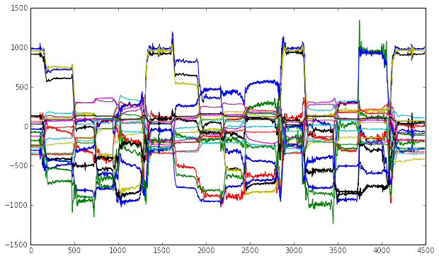
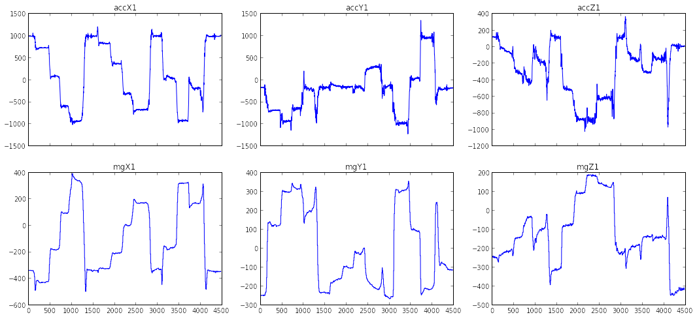
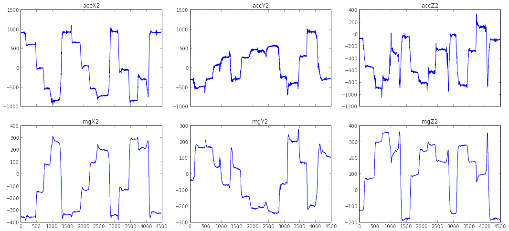
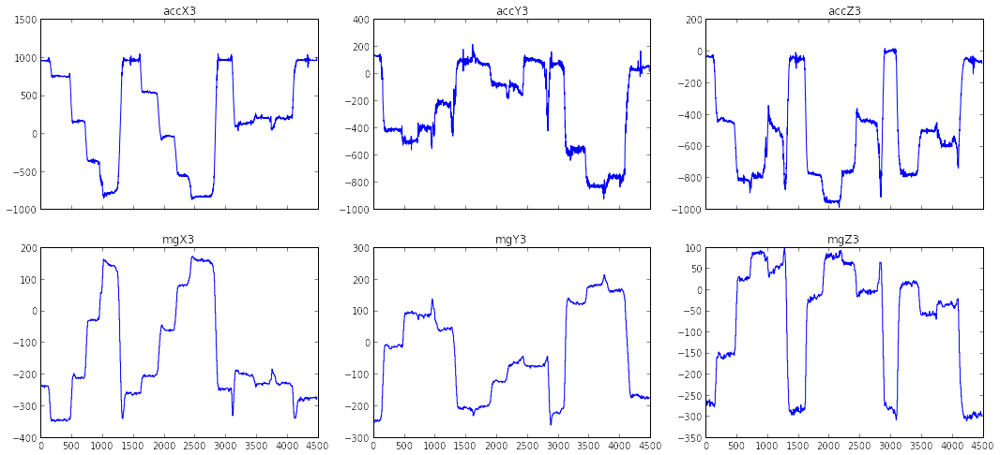
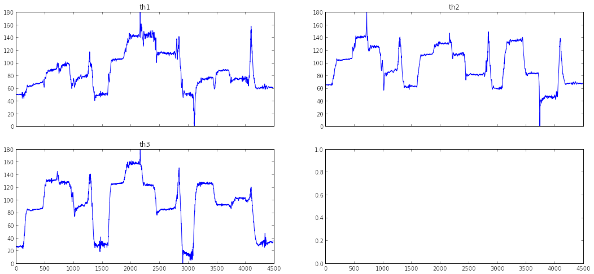
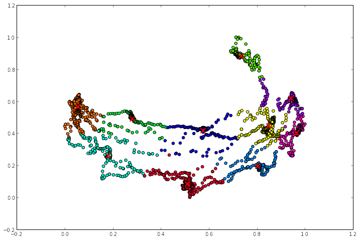

### Grafici acquisizione dati 20/6/2014

Ogni istanza del dataset originale è descritta da 6 variabili (più il marker
(?)):

* Valore accelerometro lungo l'asse X

* Valore accelerometro lungo l'asse Y

* Valore accelerometro lungo l'asse Z

* Valore magnetometro lungo l'asse X

* Valore magnetometro lungo l'asse Y

* Valore magnetometro lungo l'asse Z

Nella fase di preprocessing i dati vengono raggruppati in finestre di dimensione
*window_length* overlappate di *overlap*; da queste finestre vengono poi
estratte varie feature (vedi [features notebook](featured_data.ipynb).).

    import feature_man as fm
    import plotting as plt
    import preprocessing as prproc
    import mars as ms
    
    import matplotlib.pyplot as pl
    import matplotlib.cm as cm
    from sklearn.decomposition import PCA
    from sklearn.cluster import KMeans
    import numpy as np

    # ampiezza finestra (50 == 1s)
    window_length = 50
    # overlap tra le finestre
    overlap = window_length/2
    data,sgmdata = ms.load_dataset(window_length,overlap)
    #featdata = ms.build_dataset_features(sgmdata)

    (4487, 18)
    (4487, 21)

Plot dei dati iniziali:

    plt.plot_all(data)

Plot delle singole variabili:

    plt.plot_in_subplots(data,0,	6)

    plt.plot_in_subplots(data,6,	12)

    plt.plot_in_subplots(data,	12, 18)

    plt.plot_in_subplots(data,	18, 22)

    ---------------------------------------------------------------------------
    IndexError                                Traceback (most recent call last)

    <ipython-input-7-a622dada6a2e> in <module>()
    ----> 1 plt.plot_in_subplots(data,      18, 22)
    

    /home/ilaria/Scrivania/marsupio/python/plotting.pyc in plot_in_subplots(data, varstart, varend)
         49         f, axarr = pl.subplots(2, nsubplots/2, sharex=True,figsize=(18,8))
         50         for (i,ax) in zip(range(varstart,varend),axarr.flatten()):
    ---> 51                 ax.plot(data[:,i])
         52                 ax.set_title(fm.original_header[i])
         53         pl.show()

    IndexError: index 21 is out of bounds for axis 1 with size 21

#### Clustering dei dati originali (kMeans) 

    
    featdim = 2
    ncluster = 10
    
    pca = PCA(n_components=featdim)
    X_r = pca.fit(data).transform(data)
    kmeans = KMeans(n_clusters=ncluster)
    X_r = prproc.scale(X_r)
    kmeans.fit(X_r)
    plt.plot_clustering_result(X_r,kmeans,0,1,(12,8))
    plt.show()

    ---------------------------------------------------------------------------
    AttributeError                            Traceback (most recent call last)

    <ipython-input-8-e804c4e49735> in <module>()
          9 kmeans.fit(X_r)
         10 plt.plot_clustering_result(X_r,kmeans,0,1,(12,8))
    ---> 11 plt.show()
    

    AttributeError: 'module' object has no attribute 'show'

    

    
