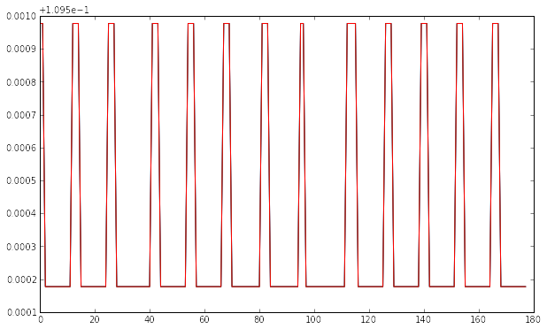

### Features estratte dai dati 

Da ogni finestra vengono estratte le seguenti feature:

* per ogni variabile :

    - media

    - mediana

    - median absolute deviation

    - standard deviation

    - minimo

    - massimo

* per ogni terna di accelerometri:

    - signal magnitude area

* per coppie di assi di ogni accelerometro e coppie di assi di ogni
magnetometro:

    - correlazione

* per ogni terna di assi degli accelerometri e dei magnetometri:

    - trasformata discreta di fourier

    - entropia della trasformata di fourier

In totale ogni segmento di dati viene descritto da 159 feature.

    import feature_man as fm
    import plotting as plt
    import preprocessing as prproc
    
    import matplotlib.pyplot as pl
    import matplotlib.cm as cm
    
    from sklearn.decomposition import PCA
    from sklearn.cluster import KMeans
    import numpy as np
    
    import mars as ms
    
    
    window_length = 50
    overlap = window_length/2
    
    # legge il dataset da file e lo ritorna "normale" e già segmentato
    data,sgmdata = ms.load_dataset(window_length,overlap)
    
    # estrae le feature dai dati segmentati
    # in header sono elencate in ordine le label di tutte le feature estratte
    featdata,header = ms.build_dataset_features(sgmdata)
    
    # seleziona gli indici delle features relative alla media
    idxs= ms.select_indexes(fm.original_header,"_avg")
    #print featdata[0,idxs]
    #plt.plot_in_subplots(featdata,idxs)
    plt.plot_all(featdata[:,idxs])

    accX1_avg
    accY1_avg
    accZ1_avg
    mgX1_avg
    mgY1_avg
    mgZ1_avg
    accX2_avg
    accY2_avg
    accZ2_avg
    mgX2_avg
    mgY2_avg
    mgZ2_avg
    accX3_avg
    accY3_avg
    accZ3_avg
    mgX3_avg
    mgY3_avg
    mgZ3_avg
    th1_avg
    th2_avg
    th3_avg

    idxs= ms.select_indexes(fm.original_header,"_stdev")
    #print featdata[0,idxs]
    #plt.plot_in_subplots(featdata,idxs)
    plt.plot_all(featdata[:,idxs])

    accX1_stdev
    accY1_stdev
    accZ1_stdev
    mgX1_stdev
    mgY1_stdev
    mgZ1_stdev
    accX2_stdev
    accY2_stdev
    accZ2_stdev
    mgX2_stdev
    mgY2_stdev
    mgZ2_stdev
    accX3_stdev
    accY3_stdev
    accZ3_stdev
    mgX3_stdev
    mgY3_stdev
    mgZ3_stdev
    th1_stdev
    th2_stdev
    th3_stdev

    idxs= ms.select_indexes(fm.original_header,"_min")
    #print featdata[0,idxs]
    #plt.plot_in_subplots(featdata,idxs)
    plt.plot_all(featdata[:,idxs])

    accX1_min
    accY1_min
    accZ1_min
    mgX1_min
    mgY1_min
    mgZ1_min
    accX2_min
    accY2_min
    accZ2_min
    mgX2_min
    mgY2_min
    mgZ2_min
    accX3_min
    accY3_min
    accZ3_min
    mgX3_min
    mgY3_min
    mgZ3_min
    th1_min
    th2_min
    th3_min

    idxs= ms.select_indexes(fm.original_header,"_max")
    #print featdata[0,idxs]
    #plt.plot_in_subplots(featdata,idxs)
    plt.plot_all(featdata[:,idxs])

    accX1_max
    accY1_max
    accZ1_max
    mgX1_max
    mgY1_max
    mgZ1_max
    accX2_max
    accY2_max
    accZ2_max
    mgX2_max
    mgY2_max
    mgZ2_max
    accX3_max
    accY3_max
    accZ3_max
    mgX3_max
    mgY3_max
    mgZ3_max
    th1_max
    th2_max
    th3_max

    idxs= ms.select_indexes(fm.original_header,"_median")
    #print featdata[0,idxs]
    #plt.plot_in_subplots(featdata,idxs)
    plt.plot_all(featdata[:,idxs])

    accX1_median
    accY1_median
    accZ1_median
    mgX1_median
    mgY1_median
    mgZ1_median
    accX2_median
    accY2_median
    accZ2_median
    mgX2_median
    mgY2_median
    mgZ2_median
    accX3_median
    accY3_median
    accZ3_median
    mgX3_median
    mgY3_median
    mgZ3_median
    th1_median
    th2_median
    th3_median

    idxs= ms.select_indexes(fm.original_header,"_mad")
    #print featdata[0,idxs]
    #plt.plot_in_subplots(featdata,idxs)
    plt.plot_all(featdata[:,idxs])

    accX1_mad
    accY1_mad
    accZ1_mad
    mgX1_mad
    mgY1_mad
    mgZ1_mad
    accX2_mad
    accY2_mad
    accZ2_mad
    mgX2_mad
    mgY2_mad
    mgZ2_mad
    accX3_mad
    accY3_mad
    accZ3_mad
    mgX3_mad
    mgY3_mad
    mgZ3_mad
    th1_mad
    th2_mad
    th3_mad

    idxs= ms.select_indexes(fm.var_to_cor,"_cor")
    #print featdata[0,idxs]
    #plt.plot_in_subplots(featdata,idxs)
    plt.plot_all(featdata[:,idxs])

    accX1_accY1_cor
    accX2_accY2_cor
    accX3_accY3_cor
    accX1_accZ1_cor
    accX2_accZ2_cor
    accX3_accZ3_cor
    accY1_accZ1_cor
    accY2_accZ2_cor
    accY3_accZ3_cor
    mgX1_mgY1_cor
    mgX2_mgY2_cor
    mgX3_mgY3_cor
    mgX1_mgZ1_cor
    mgX2_mgZ2_cor
    mgX3_mgZ3_cor
    mgY1_mgZ1_cor
    mgY2_mgZ2_cor
    mgY3_mgZ3_cor

    idxs= ms.select_indexes(fm.var_to_sma,"_sma")
    #print featdata[0,idxs]
    #plt.plot_in_subplots(featdata,idxs)
    plt.plot_all(featdata[:,idxs])

    accX1_accY1_accZ1_sma
    accX2_accY2_accZ2_sma
    accX3_accY3_accZ3_sma

    idxs= ms.select_indexes(fm.var_to_fft,"_fft")
    #print featdata[0,idxs]
    #plt.plot_in_subplots(featdata,idxs)
    plt.plot_all(featdata[:,idxs])

    accX1_accY1_accZ1_fft
    accX2_accY2_accZ2_fft
    accX3_accY3_accZ3_fft
    mgX1_mgY1_mgZ1_fft
    mgX2_mgY2_mgZ2_fft
    mgX3_mgY3_mgZ3_fft

    idxs= ms.select_indexes(fm.var_to_fft[3:],"_entr")
    #print featdata[0,idxs]
    #plt.plot_in_subplots(featdata,idxs)
    plt.plot_all(featdata[:-2,idxs])

    mgX1_mgY1_mgZ1_entr
    mgX2_mgY2_mgZ2_entr
    mgX3_mgY3_mgZ3_entr

    idxs= ms.select_indexes(fm.var_to_fft[:3],"_entr")
    #print featdata[0,idxs]
    #plt.plot_in_subplots(featdata,idxs)
    plt.plot_all(featdata[:-2,idxs])

    accX1_accY1_accZ1_entr
    accX2_accY2_accZ2_entr
    accX3_accY3_accZ3_entr

### Clustering dati segmentati vs. plot dati etichettati

    
    featdim = 2
    ncluster = 10
    X_r = featdata
    from sklearn import preprocessing
    X_r=preprocessing.scale(X_r)
    pca = PCA(n_components=featdim)
    X_r = pca.fit(X_r).transform(X_r)
    kmeans = KMeans(n_clusters=ncluster)
    
    kmeans.fit(X_r)
    targets = fm.assign_target(featdata)
    plt.plot_clustering_and_targets(X_r,kmeans,0,1,targets,(24,16))

Dal plot del clustering vs. plot dei dati etichettati si vede che, mentre alcuni
cluster di punti vengono correttamente etichettati con lo stesso target, altri
sembrano completamente mal etichettati..molto probabilmente però la colpa è
principalmente della procedura molto approssimativa con cui ho assegnato il
target ai punti.

    
